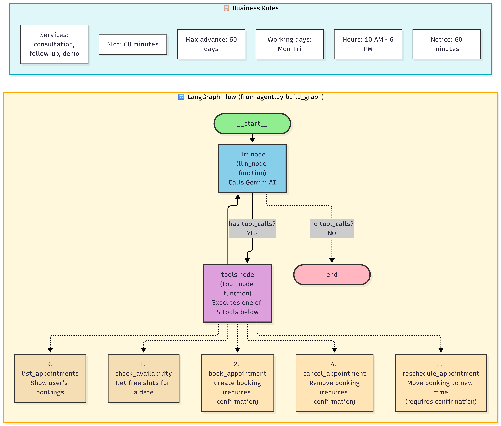

# AI Appointment Booking Agent

## Project Overview

The AI Appointment Booking Agent is an intelligent appointment management system that helps users book, reschedule, cancel, and view appointments through a conversational interface. It is powered by LangGraph and Google Gemini AI and integrates with Google Calendar for real-time scheduling and availability checks.

This project is designed to automate routine appointment workflows while enforcing business rules, improving the user experience, and reducing manual scheduling effort.

---

## Key Features

- AI-powered appointment booking through natural language conversations
- Availability checking for available time slots
- Appointment booking with validation rules
- Appointment rescheduling and cancellation
- View existing appointments
- Business rule enforcement for services, working hours, and booking constraints
- Google Calendar integration for schedule management
- Web-based interface using Streamlit
- FastAPI backend for application logic
- Deployment support using Docker, Caddy, and AWS EC2

---

## Technologies Used

- Backend: Python, FastAPI
- AI/Agent Framework: LangGraph
- LLM: Google Gemini
- Calendar Integration: Google Calendar API
- Frontend: Streamlit
- Deployment: Docker, Caddy, AWS EC2
- Domain/DNS: sslip.io

---

## How It Works



The system uses LangGraph to manage agent state, conversation flow, and tool execution. When a user sends a request, the LLM determines whether scheduling tools are needed to check availability, create an appointment, update an appointment, or retrieve data from Google Calendar.

The agent follows a structured workflow and validates each step against business rules to ensure that every booking complies with scheduling constraints before confirmation.

---

## Business Rules

| Rule | Details |
|------|---------|
| Services | Consultation, Follow-up, Demo |
| Slot Duration | 60 minutes |
| Maximum Advance Booking | 60 days |
| Working Days | Monday - Friday |
| Working Hours | 10:00 AM - 6:00 PM |
| Cancellation / Reschedule Notice | At least 60 minutes before appointment |

---

## System Flow

1. The user sends a request in natural language.
2. The AI agent interprets the request.
3. The system checks availability based on business rules.
4. The agent identifies the selected service and preferred time.
5. If required, the user is asked to confirm the final appointment details.
6. The appointment is created in Google Calendar.
7. The user can later view, modify, or cancel the appointment.

---

## Prerequisites

Before running the project, make sure you have:

- Python 3.10 or higher
- pip installed
- A Google Gemini API key
- A Google Cloud service account with access to Google Calendar
- A suitable local or Linux-based environment for running the app

---

## Setup Instructions

### 1. Clone the Repository

```bash
git clone https://github.com/SoftCr8ors/AI-Appointment-Booking-Agent.git
cd AI-Appointment-Booking-Agent
```

### 2. Create a Virtual Environment

#### Windows (PowerShell)

```powershell
python -m venv venv
.\venv\Scripts\Activate.ps1
```

#### macOS/Linux

```bash
python -m venv venv
source venv/bin/activate
```

### 3. Install Dependencies

```bash
pip install -r backend/requirements.txt
pip install -r frontend/requirements.txt
```

### 4. Configure Environment Variables

Create a `.env` file in the project root and add the following values:

```env
GEMINI_API_KEY=your_gemini_api_key_here
GEMINI_MODEL=gemini-3.5-flash-lite
CALENDAR_ID=your_google_calendar_id
TIMEZONE=Asia/Karachi
API_KEY=your_random_api_key
```

Also add your Google Calendar service account credentials in:

```bash
secrets/service_account.json
```

### 5. Run the Application

#### Start the Backend

```bash
cd backend
python main.py
```

#### Start the Frontend

```bash
cd frontend
streamlit run app.py
```

---

## Example Conversations

### Example 1: Check Availability

User question:

```text
I want to book an appointment on Monday.
```

Result:

```text
For Monday, October 5, we have the following free times available:

10:00 AM
12:00 PM
1:00 PM
3:00 PM
5:00 PM

Which service would you like (consultation, follow-up, or demo), and which time would you prefer?
```

### Example 2: Book an Appointment

User question:

```text
Book a consultation at 10 AM Monday.
```

Result:

```text
I can book a consultation for Monday, October 5, 2026 at 10:00 AM.

Do you confirm?
```

### Example 3: View Existing Appointments

User question:

```text
Show my appointments.
```

Result:

```text
You have 1 upcoming appointment:

- Consultation on Monday, October 5, 2026 at 10:00 AM
```

---

## Project Goals

This project aims to provide a practical AI-based scheduling assistant that can:

- improve scheduling efficiency
- reduce manual administrative work
- provide a user-friendly appointment experience
- support real-world business constraints in a streamlined workflow

---

## Conclusion

The AI Appointment Booking Agent demonstrates how conversational AI can be integrated with real scheduling systems to automate appointment management. It combines natural language understanding, business logic, and calendar operations to deliver a complete and scalable appointment booking experience.
